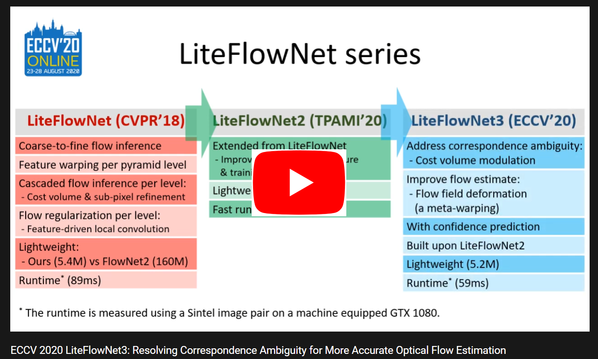
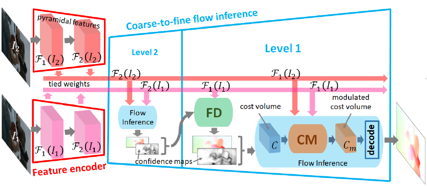
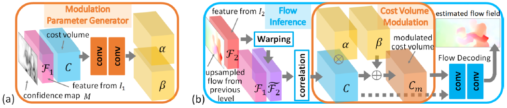
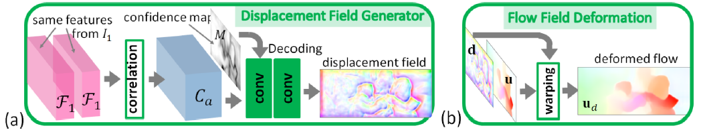
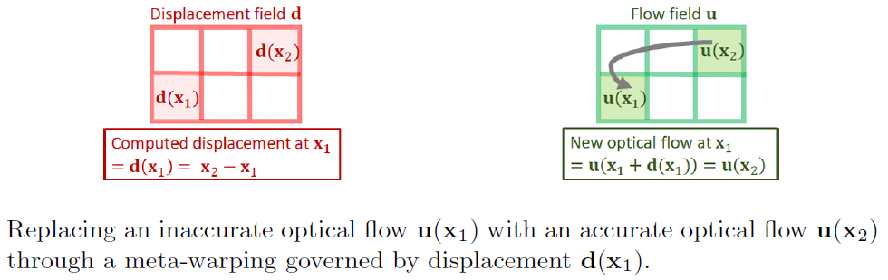
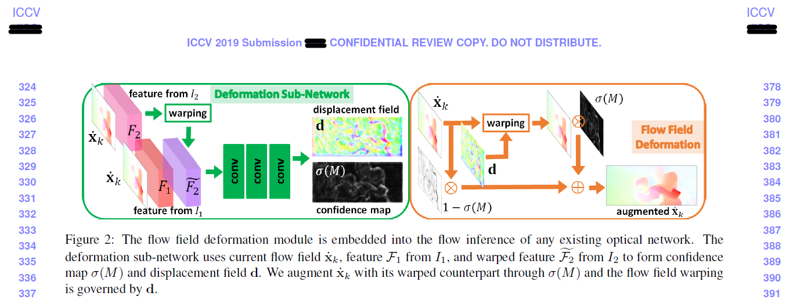

# LiteFlowNet3

<a href="https://github.com/twhui/LiteFlowNet3#Overview"> <strong>Overview</strong></a> // <a href="https://github.com/twhui/LiteFlowNet3#cost-volume-modulation-cm"> <strong>Cost Volume Modulation (CM)</strong></a> // <a href="https://github.com/twhui/LiteFlowNet3#flow-field-deformation-fd"> <strong>Flow Field Deformation (FD)</strong></a> // <a href="https://github.com/twhui/LiteFlowNet3#Performance"> <strong>Performance</strong></a> // <a href="https://github.com/twhui/LiteFlowNet3#Declaration"> <strong>Declaration</strong></a> // <a href="https://github.com/twhui/LiteFlowNet3#License-and-Citation"> <strong>License and Citation</strong></a> // <a href="https://github.com/twhui/LiteFlowNet3#Prerequisite-and-Compiling"> <strong>Prerequisite and Compiling</strong></a> // <a href="https://github.com/twhui/LiteFlowNet3#Training"> <strong>Training</strong></a> // <a href="https://github.com/twhui/LiteFlowNet3#Trained-models"> <strong>Trained Models</strong></a> // <a href="https://github.com/twhui/LiteFlowNet3#Testing"> <strong>Testing</strong></a>
 
This repository (https://github.com/twhui/LiteFlowNet3) provides the offical release of the code package for my paper "LiteFlowNet3: Resolving Correspondence Ambiguity for More Accurate Optical Flow Estimation" published in <a href="https://eccv2020.eu/"> ECCV 2020</a>. The pre-print is available on <a href="http://www.ecva.net/papers/eccv_2020/papers_ECCV/papers/123650171.pdf"> ECVA</a> or <a href="https://arxiv.org/pdf/2007.09319.pdf"> 
arXiv (July 2020)</a>. Supplementary material is released on <a href="http://www.ecva.net/papers/eccv_2020/papers_ECCV/papers/123650171-supp.pdf"> ECVA</a>.  

[A summary video is available on YouTube

](https://www.youtube.com/watch?v=Bz7ifJLYR8c?autoplay=1)

# Overview

LiteFlowNet3 is built upon our previous work <a href="https://github.com/twhui/LiteFlowNet2"> LiteFlowNet2 (TPAMI 2020) </a> with the incorporation of cost volume modulation (CM) and flow field deformation (FD) for improving the flow accuracy further. For the ease of presentation, only a 2-level encoder-decoder structure is shown. The proposed modules are applicable to other levels but not limited to level 1.

# Cost Volume Modulation (CM)

Given a pair of images, the existence of partial occlusion and homogeneous regions makes the establishment of correspondence very challenging. This situation also occurs on feature space because simply transforming images into feature maps does not resolve the correspondence ambiguity. In this way, a cost volume is corrupted and the subsequent flow decoding is seriously affected. To address this problem, we propose to filter outliers in a cost volume by using an adaptive modulation before performing the flow decoding. Besides, a confidence map is introduced to facilitate generating modulation parameters. 
 

# Flow Field Deformation (FD)

In coarse-to-fine flow estimation, a flow estimate from the previous level is used as the flow initialization for the next level. This highly demands the previous estimate to be accurate. Otherwise, erroneous optical flow is propagated to the subsequent levels. Due to local flow consistency, neighboring image points that have similar feature vectors have similar optical flow. With this motivation, we propose to refine a given flow field by replacing each inaccurate optical flow with an accurate one from a nearby position. The refinement can be easily achieved by meta-warping of the flow field according to a displacement field. An auto-correlation (self-similarity) cost volume of feature map is used to store the similarity score of neighboring image points. To avoid trivial solution, a confidence map associated with the given flow field is used to guide the displacement decoding from the cost volume. 

# Performance
</ul>
<table>
<thead>
<tr>
<th align="center"></th>
<th align="center">Sintel Clean Testing Set</th>
<th align="center">Sintel Final Testing Set</th>
<th align="center">KITTI12 Testing Set (Avg-All)</th>
<th align="center">KITTI15 Testing Set (Fl-fg)</th>
<th align="center">Model Size (M)</th> 
<th align="center">Runtime* (ms) GTX 1080</th> 
</tr>
<tr>
<td align="center">LiteFlowNet (CVPR18)</td>
<td align="center">4.54</td>
<td align="center">5.38</td>
<td align="center">1.6</td>
<td align="center">7.99%</td>
<td align="center">5.4</td>
<td align="center">88</td>
</tr> 
<tr>
<td align="center">LiteFlowNet2 (TPAMI20)</td>
<td align="center">3.48</td>
<td align="center">4.69</td>
<td align="center">1.4</td>
<td align="center">7.64%</td>
<td align="center">6.4</td>
<td align="center"><strong>40</strong></td>
</tr> 
<tr>
<td align="center">HD3 (CVPR19)</td>
<td align="center">4.79</td>
<td align="center">4.67</td>
<td align="center">1.4</td>
<td align="center">9.02%</td>
<td align="center">39.9</td>
<td align="center">128</td>
</tr> 
<tr>
<td align="center">IRR-PWC (CVPR19)</td>
<td align="center">3.84</td>
<td align="center">4.58</td>
<td align="center">1.6</td>
<td align="center">7.52%</td>
<td align="center">6.4</td>
<td align="center">180</td>
</tr>
<tr>
<td align="center"><strong>LiteFlowNet3 (ECCV20)</strong></td>
<td align="center"><strong>3.03</strong></td>
<td align="center"><strong>4.53</strong></td>
<td align="center"><strong>1.3</strong></td>
<td align="center"><strong>6.96%</strong></td>
<td align="center"><strong>5.2</strong></td>
<td align="center">59</td>
</tr>    
</tbody></table>

Note: *Runtime is averaged over 100 runs for a Sintel's image pair of size 1024 × 436. 

# Declaration
Before LiteFlowNet3 was published in <a href="https://eccv2020.eu/">ECCV 2020</a>, it was submitted to <a href="https://iccv2019.thecvf.com/">ICCV 2019</a> and <a href="http://cvpr2020.thecvf.com/">CVPR 2020</a>. The old version of Flow Field Deformation (ICCV 2019 submission) is not well-designed. Masking of deformed flow field in some image positions is not necessary as this is equivalent to have zero displacement in the displacement field d, i.e. d(x0) = 0 for some image positions x0.

Two recent works [<a href="https://arxiv.org/pdf/2011.02156.pdf">a</a>, <a href="https://arxiv.org/pdf/2012.00212.pdf">b</a>] also claimed very similar contributions (including the motivations and technical details) as our <a href="https://github.com/twhui/LiteFlowNet3#flow-field-deformation-fd"> Flow Field Deformation</a>. We need to declare that we are the first to propose this contribution for improving optical flow estimation but not them.

[a] <a href="https://arxiv.org/pdf/2011.02156.pdf">CoT-AMFlow: Adaptive Modulation Network with Co-Teaching Strategy for Unsupervised Optical Flow Estimation, CoRL 2020</a>.

Note: The motivation and technical detail of Flow Modulation Module (FMM) (Sect. 3.1) in their <a href="https://arxiv.org/pdf/2011.02156.pdf">CoRL 2020 paper</a> are very similar to that of Flow Field Deformation (FD) (Sect. 3.3) in our <a href="https://arxiv.org/pdf/2007.09319.pdf"> ECCV 2020 paper</a>. The only difference between FMM and FD is that their confidence map is explictly computed to adapt for the unsupervised training while we implictly learn it from the training labels. 

[b] <a href="https://arxiv.org/pdf/2012.00212.pdf">UPFlow: Upsampling Pyramid for Unsupervised Optical Flow Learning, CVPR 2021</a>.

Note: The motivation and some parts of the technical detail of Self-guided Upsample Module (Sect. 3.2) in their <a href="https://arxiv.org/pdf/2012.00212.pdf"> CVPR 2021 paper</a> is similar to our Flow Field Deformation (FD) (Sect. 3.3) in our <a href="https://arxiv.org/pdf/2007.09319.pdf"> ECCV 2020 paper</a>. In fact, their Self-guided Upsample Module is very simialr to the early design in our ICCV 2019 submission.

# License and Citation 
This software and associated documentation files (the "Software"), and the research paper (LiteFlowNet3: Resolving Correspondence Ambiguity for More Accurate Optical Flow Estimation) including but not limited to the figures, and tables (the "Paper") are provided for academic research purposes only and without any warranty. Any commercial use requires my consent. When using any parts of the Software or the Paper in your work, please cite the following papers:

<pre><code>@InProceedings{hui20liteflownet3,    
 author = {Tak-Wai Hui and Chen Change Loy},    
 title = {{LiteFlowNet3: Resolving Correspondence Ambiguity for More Accurate Optical Flow Estimation}}, 
 journal = {{Proceedings of the European Conference on Computer Vision (ECCV)}},
 year = {2020},    
 pages = {169--184},
}</code></pre>

<pre><code>@InProceedings{hui20liteflownet2,    
 author = {Tak-Wai Hui and Xiaoou Tang and Chen Change Loy},    
 title = {{A Lightweight Optical Flow CNN - Revisiting Data Fidelity and Regularization}, 
 journal = {{IEEE Transactions on Pattern Analysis and Machine Intelligence}},
 year = {2020},    
 url = {http://mmlab.ie.cuhk.edu.hk/projects/LiteFlowNet/} 
}</code></pre>

<pre><code>@InProceedings{hui18liteflownet,    
 author = {Tak-Wai Hui and Xiaoou Tang and Chen Change Loy},    
 title = {{LiteFlowNet: A Lightweight Convolutional Neural Network for Optical Flow Estimation}},    
 booktitle = {{Proceedings of IEEE Conference on Computer Vision and Pattern Recognition (CVPR)}},    
 year = {2018},    
 pages = {8981--8989},
 url = {http://mmlab.ie.cuhk.edu.hk/projects/LiteFlowNet/} 
}</code></pre>

# Prerequisite and Compiling
LiteFlowNet3 uses the same Caffe package as LiteFlowNet. Please refer to the details in <a href="https://github.com/twhui/LiteFlowNet#Prerequisite"> LiteFlowNet GitHub repository</a>.

# Training
Please refer to the training steps in <a href="https://github.com/twhui/LiteFlowNet#Training"> LiteFlowNet GitHub repository</a> and adopt the training protocols in <a href="http://www.ecva.net/papers/eccv_2020/papers_ECCV/papers/123650171.pdf"> LiteFlowNet3 paper</a>.

# Trained Models	
Download the models (<a href="https://www.dropbox.com/s/am76x1cg735ekbd/LiteFlowNet3-ft-sintel.tar.gz?dl=0">LiteFlowNet3-ft-sintel</a>, <a href="https://www.dropbox.com/s/a1bbpqek3o5i1vm/LiteFlowNet3-ft-kitti.tar.gz?dl=0">LiteFlowNet3-ft-kitti</a>, <a href="https://www.dropbox.com/s/0j2wk17z742cd65/LiteFlowNet3-S-ft-sintel.tar.gz?dl=0">LiteFlowNet3-S-ft-sintel</a>, <a href="https://www.dropbox.com/s/13fszxgssf6qv2k/LiteFlowNet3-S-ft-kitti.tar.gz?dl=0">LiteFlowNet3-S-ft-kitti</a>) and then place the models in the folder <code>models/trained</code>.

# Testing 
1. Open the testing folder
<pre><code>$ cd LiteFlowNet3/models/testing</pre></code>

2. Create a soft link in the folder <code>/testing</code>
<pre><code>$ ln -s ../../build/tools bin</code></pre>

3. Replace <code>MODE</code> in <code>./test_MODE.py</code> to <code>batch</code> if all the images has the same resolution (e.g. Sintel dataset), otherwise replace it to <code>iter</code> (e.g. KITTI dataset).

4. Replace <code>MODEL</code> in lines 9 and 10 of <code>test_MODE.py</code> to one of the trained models (e.g. <code>LiteFlowNet3-ft-sintel</code>).

5. Run the testing script. Flow fields (<code>MODEL</code>-0000000.flo, <code>MODEL</code>-0000001.flo, ... etc) are stored in the folder <code>/testing/results</code> having the same order as the image pair sequence. 
<pre><code>$ test_MODE.py img1_pathList.txt img2_pathList.txt results</code></pre>
